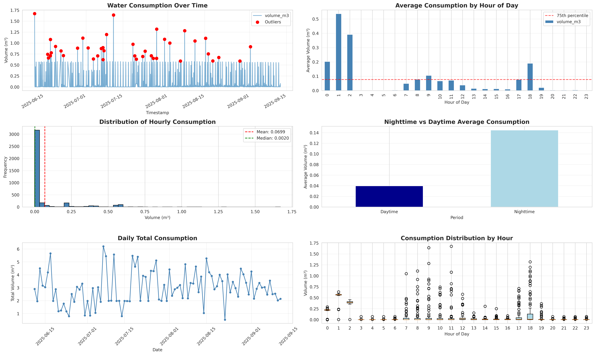

# Smart Water Leakage Detection System 💧


An advanced, containerized system for analyzing smart water meter data to detect potential leaks. This project utilizes **7 distinct detection methods**, ranging from statistical analysis to unsupervised machine learning, to provide a robust risk assessment for each device.

## 🚀 Features

*   **RESTful API:** Secure endpoint to query leakage status by device name.
*   **Automated Nightly Analysis:** Scheduled background task (default 01:00 AM) to process daily data.
*   **Comprehensive Detection Suite:**
    1.  **Statistical Analysis:** Z-Score & IQR outlier detection.
    2.  **Nighttime Consumption:** Checks for flow during 11 PM - 5 AM (IWA Standard).
    3.  **Continuous Flow:** Identifies non-stop water usage over extended periods.
    4.  **Isolation Forest:** AI-based anomaly detection for irregular patterns.
    5.  **Baseline Comparison:** Deviations from historical hourly averages.
    6.  **Pattern Recognition:** Spikes and unusual daily totals.
    7.  **DBSCAN Clustering:** Density-based spatial clustering for noise detection.
*   **Data Persistence:** Results are exported as CSV reports.
*   **Dockerized:** Ready for easy deployment with `docker-compose`.

## 🛠️ Prerequisites

*   **Docker** & **Docker Compose**
*   **Python 3.9+** (only for local development)

## 📦 Installation & Deployment

### 1. Clone the Repository
```bash
git clone https://github.com/yourusername/water-leakage-detection.git
cd water-leakage-detection
```

### 2. Configuration
Create a `.env` file or modify `docker-compose.yml` with your database credentials.

**Environment Variables:**

| Variable | Description | Default |
| :--- | :--- | :--- |
| `DB_HOST` | PostgreSQL Host | `localhost` |
| `DB_PORT` | PostgreSQL Port | `5432` |
| `DB_NAME` | Database Name | `postgres` |
| `DB_USER` | Database User | `postgres` |
| `DB_PASSWORD` | Database Password | `password` |
| `DB_TABLE_NAME`| Table containing meter data | `uplinks` |
| `API_TOKEN` | Secret token for API access | `default-secret-token` |
| `SCHEDULE_MODE`| Enable nightly scheduler | `true` |

### 3. Run with Docker
```bash
docker-compose up -d --build
```
This starts two services:
*   **API:** Accessible at `http://localhost:8005`
*   **Analyzer:** Runs in the background (scheduled).

## 🔌 API Usage

**Base URL:** `http://YOUR_SERVER_IP:8005`

### Authentication
Include the `X-API-Token` header in all requests.
```bash
X-API-Token: YOUR_SECURE_API_TOKEN
```

### Endpoints

#### Check Leak Status
*   **URL:** `/leak-check/{device_name}`
*   **Method:** `GET`
*   **Success Response:**
    ```json
    {
      "device_name": "Device_123",
      "is_leaking": true,
      "risk_score": 8,
      "details": {
        "method1_statistical": { "outliers_count": 12, "status": "LEAK" },
        "method2_nighttime": { "ratio": 0.65, "status": "CRITICAL" }
        // ... other methods
      }
    }
    ```

## � Output Example

Here is an example of the visualization generated by the analysis:

<p align="center">
  
</p>

## �📊 Risk Assessment Logic

The system calculates a **Risk Score (0-10)** based on the findings:
*   **Nighttime Flow:** +2 to +3 points (High weight)
*   **Continuous Flow:** +1 to +5 points (High weight)
*   **Statistical Anomalies:** +2 points
*   **AI Detection:** Supplementary indicators

**Verdict:**
*   **Score < 4:** ✅ Normal
*   **Score ≥ 4:** 🔴 Leak Detected

## 🤝 Contribution

Contributions are welcome! Please fork the repository and submit a Pull Request.

1.  Fork the Project
2.  Create your Feature Branch (`git checkout -b feature/AmazingFeature`)
3.  Commit your Changes (`git commit -m 'Add some AmazingFeature'`)
4.  Push to the Branch (`git push origin feature/AmazingFeature`)
5.  Open a Pull Request

## 👥 Authors

*   **Hubert Homaei** - *Initial work & Lead Developer*
    *   📧 Email: [homaei@ieee.org](mailto:homaei@ieee.org)
    *   [GitHub Profile](https://github.com/Homaei)
    *   Extremadura University, Caceres, Spain 🇪🇸

*   **Iman Khazrak** - *Contributor & Researcher*
    *   📧 Email: [ikhazra@bgsu.edu](mailto:ikhazra@bgsu.edu)
    *   [GitHub Profile](https://github.com/imankhazrak)
    *   Bowling Green State University, Toledo, OH, USA 🇺🇸

## 🙏 Acknowledgments

*   **Special Thanks to Ambling Ingeniería y Servicios, S.L.** for their support and contribution to this project.

## 📄 License

Distributed under the MIT License. See `LICENSE` for more information.
